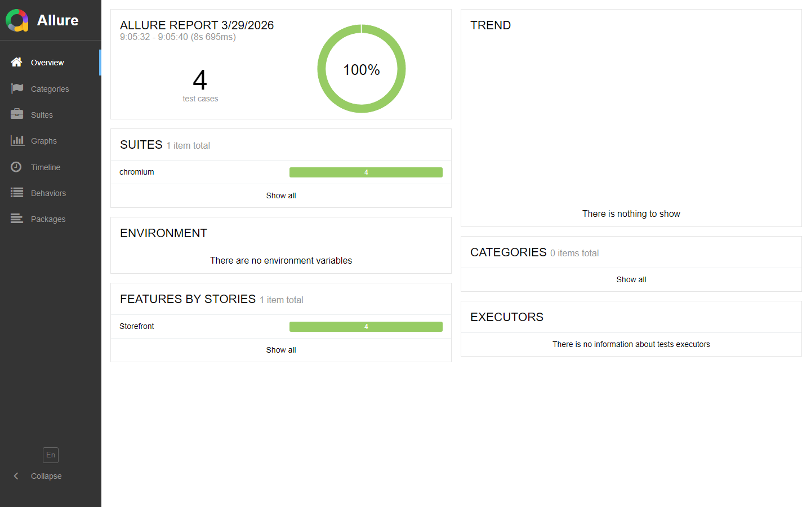
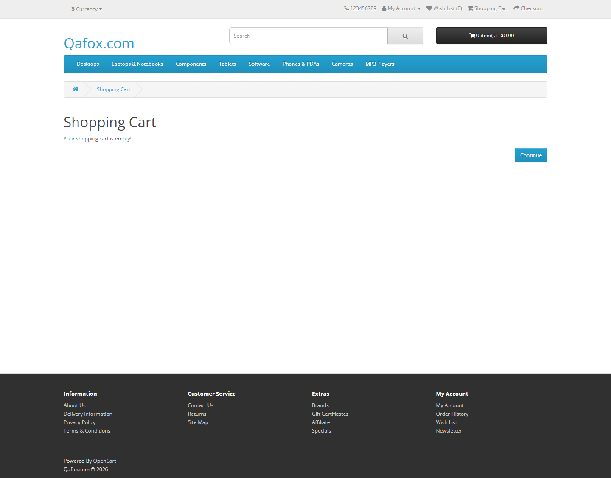

[](https://github.com/melv-narrow/tutorialsninja-playwright/actions/workflows/ci.yml) [](https://melv-narrow.github.io/tutorialsninja-playwright/)

# TutorialsNinja Playwright Showcase

Playwright + TypeScript end-to-end automation suite for the TutorialsNinja OpenCart demo at [tutorialsninja.com/demo](https://tutorialsninja.com/demo/index.php?route=common/home). The project is designed as a public QA portfolio piece with CI/CD, Allure history, and ISTQB-style risk-based layering.

## Highlights

- Playwright best practices: stable locators, isolated tests, project-based auth setup, failure artifacts, and Chromium-first CI.
- TypeScript best practices: strict compiler settings, typed helpers, ESLint, and Prettier.
- ISTQB-inspired structure: `@smoke` for critical business flow confidence, `@regression` for broader risk coverage, `@security` for session controls, and `@env-flaky` for demo-environment-sensitive checks.
- Allure report taxonomy: `epic`, `feature`, `story`, `severity`, and tags are attached through a shared helper so the report reads like a test management dashboard.
- GitHub Actions automation: push and pull request smoke runs, manual dispatch suite selection, nightly full runs, and automated Allure publishing with trend history.

## Coverage Map

### Smoke

- Home page rendering and primary navigation entry points
- Search flow for a featured product
- Add-to-cart happy path
- Register and login entry-point reachability

### Regression

- Run-scoped account registration setup
- Login and logout lifecycle
- Wishlist add, reload persistence, and removal
- Newsletter preference management
- Catalog sorting and product comparison
- Cart quantity updates and removal
- Protected-route redirects after logout
- Back/refresh invalidation after logout
- Session-expiry simulation by clearing cookies

### Environment-Flaky

- Currency switching on the shared live demo

`@env-flaky` checks stay outside the main gating path and are intended for manual dispatch or nightly visibility.

## Project Layout

```text
.github/workflows/ci.yml   CI, report publishing, nightly scheduling
src/config                 Typed runtime config and repo paths
src/fixtures               Shared QA test wrapper and fixtures
src/pages                  Lightweight page objects
src/support                Routes, user data, auth persistence, Allure metadata
tests/setup                Auth bootstrap project
tests/smoke                Fast confidence checks
tests/regression           Broader authenticated, cart, catalog, and security coverage
docs/screenshots           Portfolio-friendly report and flow screenshots
```

## Local Setup

```bash
npm install
npx playwright install chromium
```

## Scripts

```bash
npm test                 # smoke suite
npm run test:smoke
npm run test:regression
npm run test:env-flaky
npm run test:full
npm run lint
npm run typecheck
npm run format:check
npm run report
npm run report:open
```

`npm run report` restores local Allure history before generating the new HTML report. On local machines, the Allure CLI needs Java. In CI, report generation and publishing are fully automated, so the GitHub Pages report is the default frictionless viewing path.

## Allure Workflow

1. Playwright writes raw results to `allure-results/`.
2. The report job restores `history/` from the previous `gh-pages` publish.
3. `npm run report` generates a fresh `allure-report/` while preserving trends.
4. GitHub Actions deploys the report to GitHub Pages.

This keeps historical trend widgets meaningful over time instead of resetting on every run.

## Visuals

Allure dashboard snapshot:



Authenticated TutorialsNinja flow snapshot:



## Branch Protection

Recommended manual branch protection for `main`:

- Require the `ci` workflow to pass before merging.
- Require branches to be up to date before merging.
- Restrict force pushes and direct pushes to `main`.

## GitHub Topics

Recommended repository topics:

- `playwright`
- `typescript`
- `allure`
- `github-actions`
- `e2e`
- `qa-automation`
